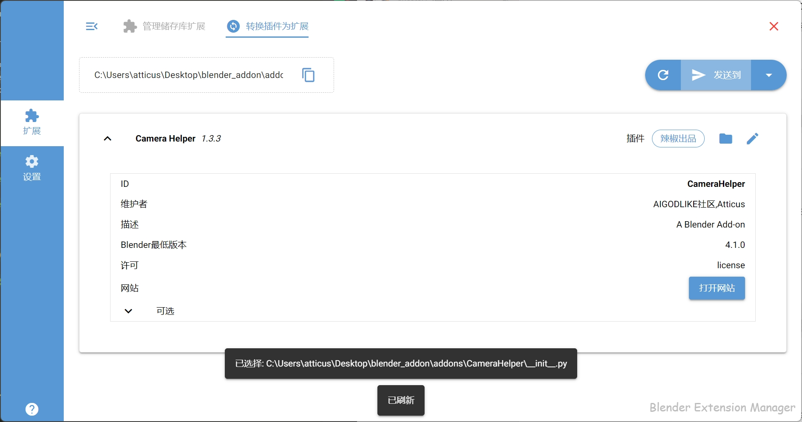
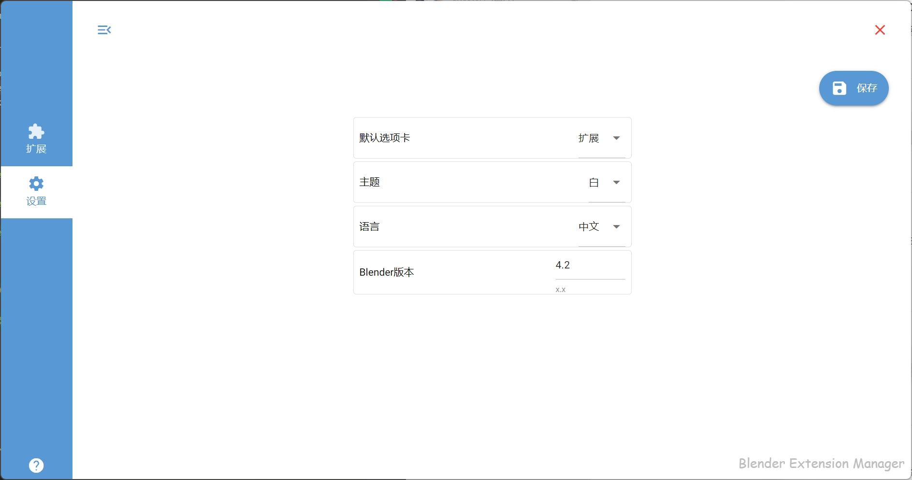
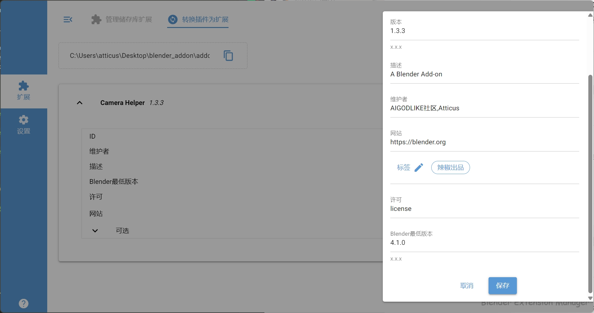

# Intro

This is a native app which allow you to install, update and remove Blender extensions

# Download

TODO

# Feature

## Extension
+ Manage(Local repo)
    1. select one repo
    2. edit / remove extension
    3. search
+ Convert addon to extension
    1. select .py/ folder addon
    2. make it an extension
    3. edit and send to repo (no-english recommand)
    4. make it a zip as extension
+ Edit
    + edit extension info
    + edit extension tags






Edit Dialog / Edit Tags




# Usage

1. Clone the repository

```
git clone <repository_url>
cd <repository_directory>
```

2. Set up a virtual environment

```
python -m venv venv
venv\Scripts\activate  # on Windows
```

3. Install the required dependencies

```
pip install -r requirements.txt
```

### run

```
python main.py --dev
```

+ `--dev` auto-reload
+ `--web` run on browser

### build

> only windows now
> windows_output: .dist/BEM.exe

```
python build.py
```